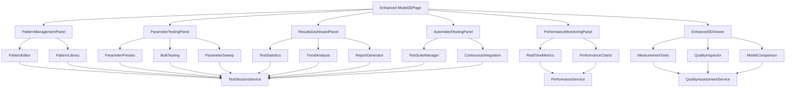

# Design Document

## Overview

This design document outlines the comprehensive enhancement of the 3D Model Generation Test UI/UX interface. The enhancement transforms the existing functional testing interface into a modern, intuitive, and powerful tool that provides real-time feedback, advanced testing capabilities, and comprehensive result analysis. The design follows the existing project architecture patterns while introducing new modular components that integrate seamlessly with the current system.

The enhancement centers on creating a dashboard-style testing interface with multiple specialized panels: pattern management, parameter testing, performance monitoring, 3D visualization, and results analysis. Each panel operates independently while maintaining shared state through the existing AppContext system.

## Steering Document Alignment

### Technical Standards (tech.md)
- Follows React functional component patterns with TypeScript
- Utilizes existing service layer architecture (Model3DService, etc.)
- Maintains separation of concerns between UI, business logic, and data layers
- Implements responsive design principles with CSS modules

### Project Structure (structure.md)
- New components follow existing `src/components` organization
- Services extend current `src/services` pattern
- Utilities added to `src/utils` following single-responsibility principle
- Types added to `src/types` for new data models

## Code Reuse Analysis

### Existing Components to Leverage
- **Model3D**: Extended with enhanced parameter controls and real-time feedback
- **ModelViewer**: Enhanced with measurement tools, quality inspection, and comparison features
- **AppContext**: Extended to include test session state and performance metrics
- **ErrorBoundary**: Reused for comprehensive error handling in testing workflows
- **FileUpload**: Extended to support batch pattern uploads and validation

### Integration Points
- **Model3DService**: Extended with performance monitoring and batch testing capabilities
- **MeshGenerator**: Enhanced with progress callbacks and quality assessment
- **OBJExporter**: Extended with multiple format support and quality settings
- **AppState**: Extended with testing session state, performance metrics, and test history
- **Existing CSS Variables**: Leveraged for consistent theming and responsive design

### Service Layer Extensions
- **TestSessionService**: New service managing test workflows and session persistence
- **PerformanceService**: New service for real-time performance monitoring
- **QualityAssessmentService**: New service for 3D model quality analysis

## Architecture

The enhanced testing interface follows a modular dashboard architecture with specialized panels that communicate through a centralized state management system. The design emphasizes real-time feedback, progressive disclosure of advanced features, and comprehensive data visualization.

### Modular Design Principles
- **Single File Responsibility**: Each component handles one specific testing concern (pattern management, performance monitoring, etc.)
- **Component Isolation**: Testing panels are self-contained with clear interfaces
- **Service Layer Separation**: Business logic remains in services, UI components handle presentation only
- **Utility Modularity**: Testing utilities broken into focused, reusable modules



## Components and Interfaces

### Enhanced Model3DPage
- **Purpose:** Main container orchestrating all testing panels with responsive layout
- **Interfaces:** 
  - `setActivePanel(panel: TestPanel): void`
  - `updateTestSession(session: TestSession): void`
  - `exportTestResults(format: ExportFormat): void`
- **Dependencies:** TestSessionService, PerformanceService, AppContext
- **Reuses:** Existing layout patterns, workflow steps component

### PatternManagementPanel
- **Purpose:** Visual pattern creation, editing, and library management
- **Interfaces:**
  - `createPattern(config: PatternConfig): DotPattern`
  - `editPattern(pattern: DotPattern, edits: PatternEdit[]): DotPattern`
  - `loadPatternFromLibrary(id: string): DotPattern`
  - `savePatternToLibrary(pattern: DotPattern, metadata: PatternMetadata): void`
- **Dependencies:** PatternEditor, PatternLibrary, FileService
- **Reuses:** Existing FileUpload component, validation utilities

### ParameterTestingPanel
- **Purpose:** Advanced parameter configuration with presets and bulk testing
- **Interfaces:**
  - `loadParameterPreset(preset: ParameterPreset): Model3DParams`
  - `runBulkTest(patterns: DotPattern[], paramSets: Model3DParams[]): TestResult[]`
  - `runParameterSweep(pattern: DotPattern, sweepConfig: SweepConfig): SweepResult[]`
  - `compareParameterResults(results: TestResult[]): ComparisonData`
- **Dependencies:** Model3DService, TestSessionService
- **Reuses:** Existing parameter validation, form components

### PerformanceMonitoringPanel
- **Purpose:** Real-time performance tracking and analysis
- **Interfaces:**
  - `startMonitoring(testId: string): MonitoringSession`
  - `stopMonitoring(sessionId: string): PerformanceReport`
  - `getRealtimeMetrics(): PerformanceMetrics`
  - `generatePerformanceReport(timeRange: TimeRange): PerformanceReport`
- **Dependencies:** PerformanceService, Chart.js integration
- **Reuses:** Existing error handling patterns

### Enhanced3DViewer
- **Purpose:** Advanced 3D visualization with measurement and quality tools
- **Interfaces:**
  - `addMeasurement(type: MeasurementType, points: Vector3[]): Measurement`
  - `runQualityCheck(mesh: THREE.Group): QualityReport`
  - `compareModels(models: THREE.Group[]): ComparisonResult`
  - `exportWithSettings(format: ExportFormat, settings: ExportSettings): Blob`
- **Dependencies:** ModelViewer (enhanced), QualityAssessmentService, Three.js
- **Reuses:** Existing ModelViewer, 3D interaction patterns

### ResultsDashboardPanel
- **Purpose:** Comprehensive test results visualization and reporting
- **Interfaces:**
  - `generateStatistics(tests: TestResult[]): TestStatistics`
  - `analyzeTrends(historicalData: TestHistory[]): TrendAnalysis`
  - `exportReport(format: ReportFormat, data: ReportData): Blob`
  - `filterResults(criteria: FilterCriteria): TestResult[]`
- **Dependencies:** TestSessionService, Chart.js, PDF generation
- **Reuses:** Existing table components, export utilities

### AutomatedTestingPanel
- **Purpose:** Test suite management and CI/CD integration
- **Interfaces:**
  - `createTestSuite(config: TestSuiteConfig): TestSuite`
  - `runTestSuite(suite: TestSuite): TestSuiteResult`
  - `scheduleTests(schedule: TestSchedule): void`
  - `generateCIReport(results: TestSuiteResult): CIReport`
- **Dependencies:** TestSessionService, CI integration utilities
- **Reuses:** Existing error handling, logging patterns

## Data Models

### TestSession
```typescript
interface TestSession {
  id: string
  name: string
  createdAt: Date
  updatedAt: Date
  status: 'active' | 'completed' | 'archived'
  
  // Test configuration
  patterns: DotPattern[]
  parameterSets: Model3DParams[]
  testResults: TestResult[]
  
  // Performance data
  performanceMetrics: PerformanceMetrics[]
  
  // Session metadata
  tags: string[]
  notes: string
  author: string
}
```

### TestResult
```typescript
interface TestResult {
  id: string
  testSessionId: string
  timestamp: Date
  
  // Input data
  pattern: DotPattern
  parameters: Model3DParams
  
  // Results
  success: boolean
  processingTime: number
  meshStats: MeshStats
  qualityScore: number
  
  // Performance data
  performanceMetrics: PerformanceSnapshot
  
  // Error handling
  error?: string
  warnings: string[]
  
  // Export information
  exportedFormats: ExportResult[]
}
```

### PerformanceMetrics
```typescript
interface PerformanceMetrics {
  timestamp: Date
  testId: string
  
  // Resource usage
  memoryUsage: {
    used: number
    peak: number
    available: number
  }
  
  // CPU metrics
  cpuUsage: {
    generation: number
    optimization: number
    rendering: number
  }
  
  // Timing metrics
  timings: {
    validation: number
    generation: number
    optimization: number
    rendering: number
    export: number
  }
  
  // Quality metrics
  qualityMetrics: {
    meshComplexity: number
    optimizationRatio: number
    printability: number
  }
}
```

### ParameterPreset
```typescript
interface ParameterPreset {
  id: string
  name: string
  description: string
  category: 'quality' | 'speed' | 'printing' | 'size' | 'custom'
  
  parameters: Partial<Model3DParams>
  
  // Preset metadata
  author: string
  createdAt: Date
  usageCount: number
  rating: number
  
  // Validation
  compatiblePatterns: PatternFilter[]
  recommendedFor: string[]
}
```

### QualityReport
```typescript
interface QualityReport {
  modelId: string
  timestamp: Date
  
  // Overall quality score (0-100)
  overallScore: number
  
  // Specific quality metrics
  geometry: {
    manifoldness: number
    watertightness: number
    selfIntersections: number
    duplicateVertices: number
  }
  
  // Printing quality
  printability: {
    overhangs: OverhangAnalysis[]
    supportNeed: number
    wallThickness: ThicknessAnalysis
    bridging: BridgingAnalysis[]
  }
  
  // Recommendations
  recommendations: QualityRecommendation[]
  warnings: QualityWarning[]
}
```

## Error Handling

### Error Scenarios

1. **Pattern Generation Failures**
   - **Handling:** Graceful fallback with detailed error messages and recovery suggestions
   - **User Impact:** Clear error display with specific guidance on pattern requirements and limitations

2. **Performance Monitoring Failures**
   - **Handling:** Continue test execution while logging monitoring errors, fallback to basic metrics
   - **User Impact:** Warning notification that detailed metrics unavailable, basic test results still provided

3. **3D Generation Timeout**
   - **Handling:** Configurable timeout with progress indication, allow user to cancel or extend
   - **User Impact:** Progress bar with estimated time remaining, option to cancel or continue

4. **Export Format Errors**
   - **Handling:** Try alternative formats, provide partial exports when possible
   - **User Impact:** Format-specific error messages with suggested alternatives

5. **Memory/Resource Exhaustion**
   - **Handling:** Implement resource monitoring with automatic cleanup and optimization
   - **User Impact:** Warning before resource limits, automatic optimization suggestions

6. **Concurrent Test Conflicts**
   - **Handling:** Queue management with priority levels and resource allocation
   - **User Impact:** Queue position indicator with estimated wait times

## Testing Strategy

### Unit Testing
- **Component Testing:** Each panel component tested in isolation with mock dependencies
- **Service Testing:** TestSessionService, PerformanceService, and QualityAssessmentService with comprehensive test coverage
- **Utility Testing:** All utility functions for calculations, validations, and transformations
- **Hook Testing:** Custom hooks for performance monitoring and test session management

### Integration Testing
- **Panel Communication:** Test inter-panel communication through shared state
- **Service Integration:** Verify proper integration between new services and existing Model3DService
- **Data Flow:** Test complete data flow from pattern creation through result analysis
- **Performance Integration:** Verify performance monitoring doesn't impact generation performance

### End-to-End Testing
- **Complete Test Workflows:** Full test scenarios from pattern selection to result export
- **User Journey Testing:** Critical user paths for different personas (developer, QA, project manager)
- **Performance Benchmarking:** Automated performance regression testing
- **Cross-Browser Testing:** Ensure compatibility across supported browsers
- **Responsive Design Testing:** Verify functionality across different screen sizes

### Accessibility Testing
- **Screen Reader Compatibility:** Ensure all interactive elements are accessible
- **Keyboard Navigation:** Full keyboard accessibility for all testing workflows
- **Color Contrast:** Verify sufficient contrast for all UI elements
- **Focus Management:** Proper focus handling during modal operations and panel switches

### Load Testing
- **Concurrent Testing:** Multiple simultaneous test sessions
- **Large Pattern Testing:** Performance with complex, high-resolution patterns
- **Memory Leak Detection:** Long-running test sessions without memory leaks
- **Resource Cleanup:** Proper cleanup of 3D resources and event listeners