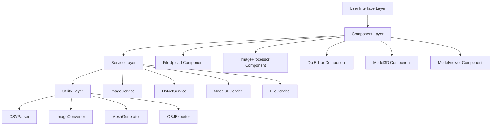

# Design Document

## Technical Architecture

### System Overview

The Dot Art 3D Converter is a React TypeScript single-page application deployed on GitHub Pages. The architecture follows a component-based design with clear separation of concerns between file handling, image processing, dot art editing, and 3D model generation.



### Technology Stack

- **Frontend Framework**: React 18 with TypeScript
- **Build Tool**: Vite for fast development and optimized builds
- **3D Graphics**: Three.js for 3D model preview and generation
- **Image Processing**: HTML5 Canvas API for image manipulation
- **File Handling**: File API and FileReader for client-side file operations
- **Deployment**: GitHub Pages with GitHub Actions CI/CD
- **Styling**: CSS Modules with responsive design

### Component Architecture

#### Core Components

1. **App Component** (`src/App.tsx`)
   - Main application shell
   - Route management between development pages
   - State management for global application state

2. **FileUpload Component** (`src/components/FileUpload.tsx`)
   - Handles CSV and image file uploads
   - File validation and error handling
   - Drag-and-drop interface

3. **ImageProcessor Component** (`src/components/ImageProcessor.tsx`)
   - Image to dot art conversion
   - Real-time threshold and resolution controls
   - Canvas-based image manipulation

4. **DotEditor Component** (`src/components/DotEditor.tsx`)
   - Interactive dot pattern editing
   - Click and range selection for toggling dots
   - Zoom and pan functionality

5. **Model3D Component** (`src/components/Model3D.tsx`)
   - 3D model generation from dot patterns
   - Three.js integration for model creation
   - Mesh optimization algorithms

6. **ModelViewer Component** (`src/components/ModelViewer.tsx`)
   - 3D model preview with Three.js
   - Interactive camera controls
   - Export functionality to OBJ format

#### Development Pages

1. **ImageLoadPage** (`src/pages/ImageLoadPage.tsx`)
   - Isolated file upload testing
   - CSV parsing validation
   - Image preview functionality

2. **ImageConversionPage** (`src/pages/ImageConversionPage.tsx`)
   - Image to dot art conversion testing
   - Threshold and resolution parameter testing
   - Real-time conversion preview

3. **DotEditPage** (`src/pages/DotEditPage.tsx`)
   - Dot pattern editing functionality testing
   - Click and range selection validation
   - State management testing

4. **Model3DPage** (`src/pages/Model3DPage.tsx`)
   - 3D model generation testing
   - Mesh optimization validation
   - Export functionality testing

5. **IntegratedApp** (`src/pages/IntegratedApp.tsx`)
   - Final integrated application
   - Complete workflow testing
   - Production-ready interface

### Data Flow Design

#### State Management

```typescript
interface AppState {
  currentPage: 'upload' | 'convert' | 'edit' | 'generate' | 'integrated'
  dotPattern: DotPattern | null
  originalImage: ImageData | null
  processedImage: ImageData | null
  model3D: Mesh | null
  conversionParams: ConversionParams
  editHistory: EditAction[]
}

interface DotPattern {
  width: number
  height: number
  data: boolean[][]
  metadata: {
    source: 'csv' | 'image'
    originalSize?: { width: number, height: number }
    conversionParams?: ConversionParams
  }
}

interface ConversionParams {
  resolution: number
  threshold: number
  invertColors: boolean
}
```

#### Service Interfaces

```typescript
interface ImageService {
  loadImage(file: File): Promise<ImageData>
  convertToDotsPattern(image: ImageData, params: ConversionParams): DotPattern
  adjustThreshold(image: ImageData, threshold: number): ImageData
  resizeImage(image: ImageData, targetResolution: number): ImageData
}

interface DotArtService {
  parseCSV(file: File): Promise<DotPattern>
  exportCSV(pattern: DotPattern): string
  toggleDot(pattern: DotPattern, x: number, y: number): DotPattern
  toggleRange(pattern: DotPattern, startX: number, startY: number, endX: number, endY: number): DotPattern
}

interface Model3DService {
  generateMesh(pattern: DotPattern): Mesh
  optimizeMesh(mesh: Mesh): Mesh
  exportOBJ(mesh: Mesh): string
  createBackgroundLayer(pattern: DotPattern): Mesh
}
```

### Algorithm Design

#### 3D Model Generation Algorithm

1. **Cube Placement**
   - For each `true` value in dot pattern, place a unit cube
   - Position cubes in 3D space maintaining grid alignment
   - Each dot represents a 1x1x1 cube in world coordinates

2. **Face Merging Optimization**
   - Identify adjacent cubes sharing faces
   - Merge shared faces to reduce triangle count
   - Implement mesh simplification to optimize for 3D printing

3. **Background Layer Generation**
   - Create background layer 1 unit below main pattern
   - Background extends 1 unit beyond pattern boundaries
   - Fill all positions in background layer (no holes)

```typescript
class MeshGenerator {
  generateCubes(pattern: DotPattern): Mesh[] {
    const cubes: Mesh[] = []
    for (let y = 0; y < pattern.height; y++) {
      for (let x = 0; x < pattern.width; x++) {
        if (pattern.data[y][x]) {
          cubes.push(this.createCube(x, 0, y))
        }
      }
    }
    return cubes
  }

  mergeFaces(cubes: Mesh[]): Mesh {
    // Implement face merging algorithm
    // Remove internal faces between adjacent cubes
    return this.optimizeMesh(cubes)
  }

  createBackground(pattern: DotPattern): Mesh {
    const backgroundCubes: Mesh[] = []
    for (let y = -1; y <= pattern.height; y++) {
      for (let x = -1; x <= pattern.width; x++) {
        backgroundCubes.push(this.createCube(x, -1, y))
      }
    }
    return this.mergeFaces(backgroundCubes)
  }
}
```

#### Image Processing Algorithm

```typescript
class ImageConverter {
  convertToGreyscale(imageData: ImageData): ImageData {
    // Convert RGB to greyscale using luminance formula
    // Y = 0.299*R + 0.587*G + 0.114*B
  }

  applyThreshold(imageData: ImageData, threshold: number): boolean[][] {
    // Convert greyscale to binary based on threshold
    // Values above threshold = true (cube), below = false (empty)
  }

  resizeToTarget(imageData: ImageData, targetSize: number): ImageData {
    // Resize image to target resolution while maintaining aspect ratio
    // Use bilinear interpolation for quality preservation
  }
}
```

### File Structure

```
src/
├── App.tsx                     # Main application component
├── index.tsx                   # Application entry point
├── components/
│   ├── FileUpload.tsx         # File upload component
│   ├── ImageProcessor.tsx     # Image processing component
│   ├── DotEditor.tsx          # Dot editing component
│   ├── Model3D.tsx            # 3D model generator
│   ├── ModelViewer.tsx        # 3D model viewer
│   └── common/
│       ├── Button.tsx         # Reusable button component
│       ├── LoadingSpinner.tsx # Loading indicator
│       └── ErrorBoundary.tsx  # Error handling component
├── pages/
│   ├── ImageLoadPage.tsx      # Image loading test page
│   ├── ImageConversionPage.tsx # Conversion test page
│   ├── DotEditPage.tsx        # Editing test page
│   ├── Model3DPage.tsx        # 3D generation test page
│   └── IntegratedApp.tsx      # Final integrated app
├── services/
│   ├── ImageService.ts        # Image processing service
│   ├── DotArtService.ts       # Dot art operations
│   ├── Model3DService.ts      # 3D model operations
│   └── FileService.ts         # File handling service
├── utils/
│   ├── CSVParser.ts           # CSV parsing utilities
│   ├── ImageConverter.ts      # Image conversion utilities
│   ├── MeshGenerator.ts       # 3D mesh generation
│   └── OBJExporter.ts         # OBJ file export utilities
├── types/
│   ├── DotPattern.ts          # Dot pattern type definitions
│   ├── ConversionParams.ts    # Conversion parameter types
│   └── AppState.ts            # Application state types
└── styles/
    ├── globals.css            # Global styles
    └── components/            # Component-specific styles
        ├── FileUpload.module.css
        ├── DotEditor.module.css
        └── ModelViewer.module.css
```

### Deployment Architecture

#### GitHub Actions Workflow

```yaml
name: Deploy to GitHub Pages
on:
  push:
    branches: [ main ]
  pull_request:
    branches: [ main ]

jobs:
  build-and-deploy:
    runs-on: ubuntu-latest
    steps:
      - uses: actions/checkout@v3
      - uses: actions/setup-node@v3
        with:
          node-version: '18'
      - run: npm ci
      - run: npm run build
      - run: npm run test
      - uses: peaceiris/actions-gh-pages@v3
        with:
          github_token: ${{ secrets.GITHUB_TOKEN }}
          publish_dir: ./dist
```

#### Build Configuration

- **Vite Configuration**: Optimized for GitHub Pages with proper base path
- **TypeScript Configuration**: Strict mode enabled with comprehensive type checking
- **ESLint/Prettier**: Code quality and formatting enforcement
- **Testing**: Vitest for unit tests, Playwright for E2E testing

### Performance Considerations

1. **Image Processing**
   - Use Web Workers for heavy image processing operations
   - Implement progressive loading for large images
   - Canvas optimization for real-time threshold adjustments

2. **3D Model Generation**
   - Implement mesh optimization algorithms to reduce polygon count
   - Use geometry instancing for repeated cube elements
   - Progressive mesh generation for large dot patterns

3. **Memory Management**
   - Dispose of unused Three.js objects and textures
   - Implement canvas cleanup after image processing
   - Use object pooling for frequently created/destroyed objects

4. **User Experience**
   - Progressive loading indicators for long operations
   - Responsive design for mobile and desktop
   - Keyboard shortcuts for power users

### Security Considerations

1. **File Validation**
   - Validate file types and sizes before processing
   - Sanitize CSV input to prevent injection attacks
   - Limit maximum file sizes to prevent memory exhaustion

2. **Client-side Safety**
   - No server communication eliminates most security vectors
   - Use Content Security Policy headers
   - Validate all user inputs before processing

### Browser Compatibility

- **Minimum Requirements**:
  - Chrome 90+, Firefox 88+, Safari 14+, Edge 90+
  - WebGL 2.0 support for 3D rendering
  - File API support for file handling
  - Canvas API support for image processing

- **Progressive Enhancement**:
  - Fallback UI for browsers without WebGL
  - Graceful degradation for older File API implementations
  - Alternative download methods for various browsers